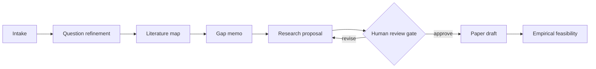

# Agentic Research Workflow for Strategy Research

A lightweight, auditable orchestration layer for turning an early-stage research puzzle into a sequence of reviewable research artifacts.

The project grew out of a practical problem: an LLM can draft text quickly, but a credible research process needs explicit stages, persistent state, skeptical review, and human approval before moving from an idea to a paper.

## What it demonstrates

- research-task decomposition
- role-based agent handoffs
- persistent state through Markdown artifacts and a JSON manifest
- dependency-aware stage execution
- a human-in-the-loop review gate
- explicit separation between generated drafts and verified research evidence
- a reproducible command-line workflow written in Python

## Workflow



The stages can be assigned to different LLM agents—for example, a question-refinement agent, literature-mapping agent, and skeptical-review agent—while a main agent coordinates files and checks dependencies.

## Important scope boundary

This repository demonstrates **LLM-based multi-agent workflow orchestration**. It is not an agent-based model of firms, inventors, or markets, and it does not claim to implement a validated multi-agent simulation.

The included version runs without an LLM or API key. It creates and validates the orchestration artifacts that agents would use. An LLM provider can be connected later without changing the research-stage contract.

## Quick start

Requires Python 3.11 or later. No third-party packages are needed.

```bash
python -m agentic_research_workflow bootstrap \
  --intake examples/sample_intake.md \
  --output demo-run

python -m agentic_research_workflow status --run-dir demo-run
python -m agentic_research_workflow validate --run-dir demo-run
```

When running directly from a clone, set `PYTHONPATH`:

```bash
PYTHONPATH=src python -m agentic_research_workflow bootstrap \
  --intake examples/sample_intake.md \
  --output demo-run
```

## Repository structure

```text
config/       Stage order, dependencies, and agent roles
docs/         Architecture and design decisions
examples/     A public, non-confidential example intake
src/          Python orchestration package
templates/    Durable Markdown stage artifacts
tests/        Deterministic tests for bootstrap and review gating
```

## Design principles

1. **Artifacts before chat history.** Each stage writes to a durable file.
2. **Proposal before paper.** A paper stage cannot open before proposal review.
3. **Human approval is explicit.** The review file must contain `decision: approve`.
4. **Uncertainty stays visible.** Templates distinguish evidence, inference, and unresolved questions.
5. **No fabricated research progress.** Creating a stage file does not mean the research in that stage has been completed.

## Example agent roles

| Role | Responsibility | Output |
|---|---|---|
| Question agent | Convert a phenomenon into a researchable question | `02_question_refinement.md` |
| Literature agent | Map research streams and identify missing evidence | `03_literature_map.md` |
| Proposal agent | Integrate theory, mechanisms, and design | `05_research_proposal.md` |
| Review agent | Stress-test contribution and feasibility | `06_review_decision.md` |
| Main orchestrator | Enforce dependencies and merge handoffs | `run_manifest.json` |

## Current limitations

- no live literature-database integration
- no automatic verification of generated citations
- no live LLM-provider adapter in the public starter version
- no agent-based simulation or emergent-behavior analysis
- substantive research quality still requires expert human judgment

## Possible extensions

- provider adapters for structured LLM outputs
- Zotero or OpenAlex literature retrieval
- provenance tracking at claim level
- experiment registries and reproducible simulation seeds
- an innovation-focused agent-based simulation layer

## Author

Junjia He — strategy and management researcher interested in empirical research, AI-assisted scientific workflows, and the validation of agent-generated behavior.

